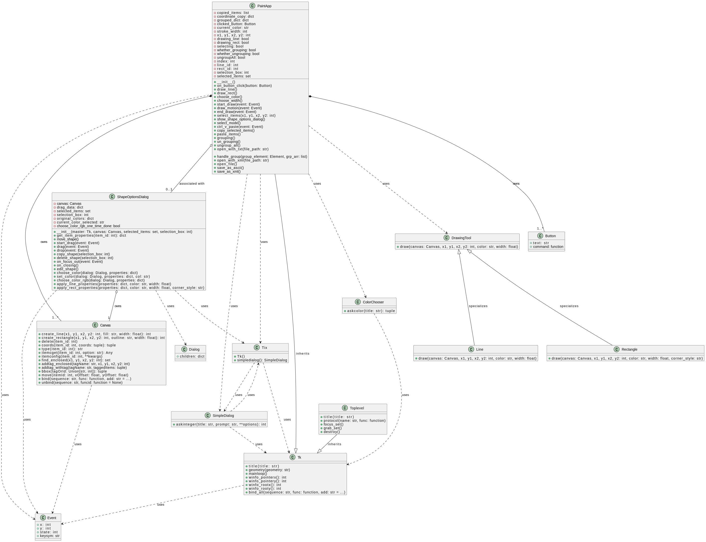
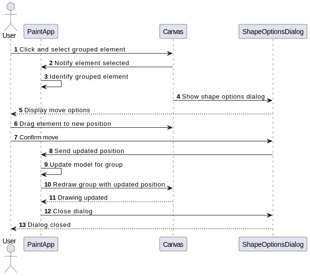
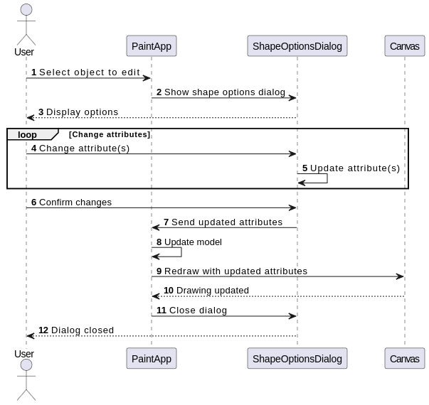

# ```PaintWizard App``` 
## Introduction
This project is a drawing editor application that allows users to draw shapes on a canvas. The application supports drawing of various shapes like rectangle, line. The application also supports features copy, move, delete.

## How to Use
run the following command to run the application
```bash
python main.py
```
The complete program is based in a single Python file. We have used the Tkinter module in Python for GUI in our application. 
## Features
This is a Python application that provides a simple paint program
with various drawing and editing features. The app is built using the
tkinter library, which is the standard GUI (Graphical User Interface)
library for Python.
The main features of the app include:

1. Drawing Tools: Users can draw lines and rectangles on the
    canvas using the provided toolbar buttons.
2. Selection and Editing: Users can select one or more shapes
    on the canvas and perform various operations such as moving,
    copying, deleting, and editing the properties (color, width,
    corner style) of the selected shapes.
3. Grouping and Ungrouping: Users can group and ungroup
    multiple shapes together, allowing them to manipulate the
    grouped shapes as a single entity.
4. Open and Save Files: Users can open existing files in either
    TXT or XML format, which contain information about the
    drawn shapes and their properties. The app can load and
    display the shapes from these files.
5. Copy and Paste: Users can copy and paste shapes within the
    canvas.

```
The app uses various UI components such as buttons, toolbars,
dialogs, and color choosers to provide an interactive user experience.
The code also includes custom functions for drawing shapes with
rounded corners and handling user input events.
```
```
Overall, this Python application provides a basic paint program
interface with essential drawing and editing capabilities, allowing
users to create, manipulate, and manage simple geometric shapes on
a canvas.
```

## Class Diagram




## Sequence Diagram





## Class Responsibility 


| Class Name | Responsibility |
|------------|----------------|
| PaintApp | The main application class that handles the overall functionality of the paint app, including drawing lines and rectangles selecting items, copying/pasting grouping/ungrouping, color selection, stroke width selection, file I/O operations, and event handling. |
| ShapeOptionsDialog | A dialog box that allows the user to manipulate selected shapes, such as moving, copying, deleting, and editing properties like color and line width. |
| DrawingTool | An abstract base class for drawing tools like Line and Rectangle.|
| Line |A concrete class that inherits from DrawingTool and is responsible for drawing lines on the canvas. |
| Rectangle | A concrete class that inherits from DrawingTool and is responsible for drawing rectangles on the canvas. |
| Button| Represents a button UI element with a text label and a command to execute when clicked.|
|Canvas| Provides a drawing surface where shapes can be created, manipulated, and displayed. It offers various methods for creating and modifying shapes, as well as handling events.|
|Dialog| A base class for dialogs, likely used by ShapeOptionsDialog.|
| ColorChooser| A utility class that provides a dialog for selecting colors.|
| SimpleDialog| A dialog box for obtaining simple input from the user, such as integers.|
|Event|Represents an event object containing information about user interactions, like mouse clicks and key presses.|

## Design Parameters

```
The UML diagram provided outlines the design of a PaintApp application, showcasing a balance among various design principles such as low coupling, high cohesion, separation of concerns, information hiding, the Law of Demeter, extensibility, and reusability. Let's discuss how these principles are reflected in the design and how they contribute to the expected product evolution:

```

1) Low Coupling and High Cohesion:
- Low coupling is achieved by having classes communicate through well-defined interfaces and
minimizing direct dependencies between them. For example, the PaintApp class interacts with
other classes like Button , Canvas , and ShapeOptionsDialog through clearly defined methods,
promoting encapsulation and reducing interdependence.
- High cohesion is ensured by organizing related functionalities within each class. For instance,
methods like draw_line(), draw_rect(), and select_items() are encapsulated within the
PaintApp class, focusing on a specific aspect of the application's behavior.

2) Separation of Concerns:
- The design separates different concerns into distinct classes. For example, the PaintApp class is
responsible for managing the overall application state and user interactions, while the
DrawingTool , Line, and Rectangle classes handle specific drawing functionalities. This
separation allows for easier maintenance and modification of individual components without
affecting the entire system.

3) Information Hiding:
- The internal details of each class are hidden from external entities, promoting encapsulation and
abstraction. For instance, the ShapeOptionsDialog class encapsulates the logic for managing
shape properties and interactions with the canvas, hiding the implementation details from the
PaintApp class.
4) Law of Demeter:
- The design adheres to the Law of Demeter by limiting the interaction between objects to only
immediate collaborators. For example, the PaintApp class interacts with the Canvas class to
perform drawing operations, without directly accessing the internal details of other classes like
DrawingTool or ShapeOptionsDialog .

5) Extensibility and Reusability:
- The design allows for easy extension and reuse of components. For instance, new drawing tools
or shapes can be added by creating subclasses of DrawingTool and implementing specific
drawing logic without modifying existing code. Similarly, the ShapeOptionsDialog class can be
reused in other applications that require shape manipulation functionalities.
6) Design Patterns:
- The design employs various design patterns to achieve its objectives. For example, the
Command pattern is used to encapsulate user actions within Button objects, allowing for easy
undo/redo functionality and decoupling user interface elements from application logic.
Additionally, the Observer pattern can be inferred from the event handling mechanisms, where
objects like Canvas and ShapeOptionsDialog observe user events and respond accordingly.


```
Overall, the design of the PaintApp application demonstrates a thoughtful balance among competing criteria,
ensuring flexibility, maintainability, and scalability in the face of evolving product requirements. By adhering to
established design principles and leveraging design patterns effectively, the design lays a solid foundation for
future enhancements and iterations of the product.
```